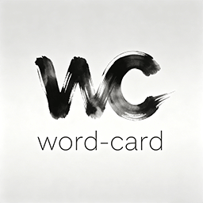

    
  
  # Word Card

 Word Card - 简洁、优雅、文字阅读向的Hexo主题

 WordPress 版 : [github.com/kankezhiyan/word-card](github.com/kankezhiyan/word-card)
  
  
  
  
  
  
  
  

# 展示

# 状态

> + 基础功能已完备，细节修缮中
> + 丰富功能将进行大版本更新

# 特性

+ **简洁优雅** - 使用 word card 前端框架，简洁优雅，仿墨水屏
+ **多端通用** - 支持PC、平板、手机，自适应各种屏幕尺寸
+ **轻量体积** - 主题文件体积小，加载速度快
+ **定制简单** - 可自定义主题色、顶栏、Banner等，提供了丰富的自定义选项
+ **时间模式** - 支持白昼、日落，晚间，夜间，微光五种时间模式，并可以根据时间自动切换或跟随系统夜间模式
+ **内容支持** - 首页、文章主页、Tag主页、分类主页、自定义页面
+ **其他** - Banner 支持官方一言展示或自定义一言等

# 注意

Word Card 使用 [GPL V3.0](https://github.com/kankezhiyan/word-card-hexo/blob/main/LICENSE) 协议开源，请遵守此协议进行二次开发等。

您**必须在页脚保留 Word Card 主题的名称及其链接**，否则请不要使用 Word Card 主题。

# TODO

+ [  ] 多语言
+ [  ] 短代码支持
+ [  ] pjax支持
+ [  ] 自定义字体支持
+ [  ] 支持图片放大预览
+ [  ] 支持背景图片自定义
+ [  ] 支持主题色自定义